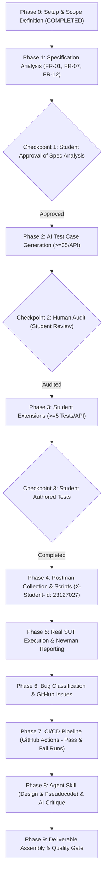

# Implementation Plan — HW06: API Testing (AI-First Software Engineering)

## Overview
This document defines the systematic, phase-by-phase execution of **HW06 – API Testing (Exercise ID: HW06-AI)** for student **Pham Ngoc Gia Bao (ID: `23127027`, GitHub: `giabaocode`)**. 

The plan strictly adheres to the course **Guiding Principles** and **Anti-AI-Cheat Constraints** defined in `2026.HW06.API Testing_En.pdf`.

---

## 1. Confirmed Feature Selection & Group Deduplication

- **Pool A:** **FR-01 — Account Registration** (`POST /api/register`)
- **Pool B:** **FR-07 — Shopping Cart** (`GET /api/cart`, `POST /api/cart`)
- **Pool C:** **FR-12 — Access Control** (Admin-only endpoints under `/api/admin/*` and data mutation endpoints)

*Non-duplication statement:* The student has personally verified that no other member in their group has chosen the exact combination `FR-01 + FR-07 + FR-12`.

---

## 2. Security Applicability Matrix (SEC-01 to SEC-07)

| SEC ID | Requirement Description | Feature | Classification | Specification Evidence | Test Layer |
| :---: | :--- | :---: | :---: | :--- | :--- |
| **SEC-01** | Passwords must not be stored in plaintext. | **FR-01** | `REQUIRES NON-API VERIFICATION` | `README.md` Line 278 (SEC-01). Registration returns `{message, id}`; verifying hashing vs. plaintext requires backend DB record inspection. | Database / Backend Verification Layer |
| **SEC-01** | Passwords must not be stored in plaintext. | **FR-07** | `NOT APPLICABLE` | Cart endpoints do not handle password persistence. | None |
| **SEC-01** | Passwords must not be stored in plaintext. | **FR-12** | `NOT APPLICABLE` | Access control enforces token role permissions, not credential storage. | None |
| **SEC-02** | Secured APIs must require valid JWT Token. | **FR-01** | `NOT APPLICABLE` | `POST /api/register` is a public endpoint by design. | None |
| **SEC-02** | Secured APIs must require valid JWT Token. | **FR-07** | `DIRECTLY APPLICABLE` | `api_specification.md` Line 112 & `README.md` Line 279. Must require valid Bearer token. | API Layer (HTTP 401/403) |
| **SEC-02** | Secured APIs must require valid JWT Token. | **FR-12** | `DIRECTLY APPLICABLE` | `README.md` Lines 177-179 & Line 279. All admin endpoints require valid JWT token. | API Layer (HTTP 401/403) |
| **SEC-03** | Admin APIs must check `role = 'admin'` in Token, not just token existence. | **FR-01** | `NOT APPLICABLE` | Registration does not require admin privileges. | None |
| **SEC-03** | Admin APIs must check `role = 'admin'` in Token, not just token existence. | **FR-07** | `NOT APPLICABLE` | Cart is a customer-facing feature for authenticated standard users. | None |
| **SEC-03** | Admin APIs must check `role = 'admin'` in Token, not just token existence. | **FR-12** | `DIRECTLY APPLICABLE` | `README.md` Lines 176-180 & Line 280; `api_specification.md` Line 173. Standard users (`role='user'`) must be blocked with 403 Forbidden. | API Layer (HTTP 403) |
| **SEC-04** | User input displayed on UI must be escaped, no `innerHTML` directly. | **FR-01** | `NOT APPLICABLE` | `README.md` Line 281 explicitly specifies: *"khi hiển thị trên UI phải được escape đúng cách, không dùng innerHTML trực tiếp."* This is a GUI/Frontend layer requirement, NOT a backend JSON API response transformation rule. JSON APIs should store and return raw data faithfully without HTML entity escaping. | GUI / Frontend Layer (Out of API test scope) |
| **SEC-04** | User input displayed on UI must be escaped. | **FR-07** | `NOT APPLICABLE` | Same as above: GUI rendering concern. | GUI / Frontend Layer |
| **SEC-04** | User input displayed on UI must be escaped. | **FR-12** | `NOT APPLICABLE` | GUI rendering concern (e.g. shipping address in FR-18). | GUI / Frontend Layer |
| **SEC-05** | Database queries must use Parameterized Query, no direct string concatenation. | **FR-01** | `DIRECTLY APPLICABLE` | `README.md` Line 282. `POST /api/register` inserts into `users` table. Must resist SQL injection payloads in `name`, `email`, `password`. | API Layer (Negative Security Testing) |
| **SEC-05** | Database queries must use Parameterized Query. | **FR-07** | `NOT APPLICABLE` | The cart implementation uses an in-memory `userCarts` structure; neither the specification nor the actual request path reaches database-query construction. | None |
| **SEC-05** | Database queries must use Parameterized Query. | **FR-12** | `DIRECTLY APPLICABLE` | `README.md` Line 282. Admin endpoints query DB with path parameter `:id` (e.g., `DELETE /api/admin/users/:id`, `PUT /api/admin/orders/:id/status`). Must resist SQLi. | API Layer (Negative Security Testing) |
| **SEC-06** | Profile update API must not allow changing `role` from client. | **FR-01** | `NOT APPLICABLE` | Registration creates a new account (default role 'user'). | None |
| **SEC-06** | Profile update API must not allow changing `role`. | **FR-07** | `NOT APPLICABLE` | Cart does not mutate user profile. | None |
| **SEC-06** | Profile update API must not allow changing `role`. | **FR-12** | `NOT APPLICABLE TO FR-12 TEST SUITE` | SEC-06 specifically governs `PUT /api/users/me` (FR-04). While relevant as background security context for role integrity, FR-04 profile-update tests will NOT be counted toward the FR-12 test suite. | None (Background Context) |
| **SEC-07** | Password reset OTP entropy, expiry, and invalidation. | **FR-01, 07, 12** | `NOT APPLICABLE` | Specific to FR-03 (Password reset workflow). | None |

---

## 3. Strict Specification vs. Inference Classification

### FR-01: Account Registration (`POST /api/register`)

| Item | Classification | Description & Official Source |
| :--- | :---: | :--- |
| **Endpoint & Method** | **SPECIFIED** | `POST /api/register` (`api_specification.md` Line 12). |
| **Request Body Fields** | **SPECIFIED** | `name` (string), `email` (string), `password` (string) (`api_specification.md` Lines 15-20). |
| **Success Status Code** | **SPECIFIED** | `200 OK` (`api_specification.md` Line 21). *Note: REST convention `201 Created` is INFERRED only; the official specification explicitly requires `200 OK`.* |
| **Success Body Schema** | **SPECIFIED** | `{"message": "User registered successfully", "id": <number>}` (`api_specification.md` Line 21). |
| **Email Validity & Uniqueness** | **SPECIFIED** | Must be valid format (`user@domain.com`) and unique in system (`README.md` Line 33). |
| **Password Complexity Rule** | **SPECIFIED** | Min 8 chars, $\ge 1$ uppercase, $\ge 1$ lowercase, $\ge 1$ digit, $\ge 1$ special char (`@$!%*?&`) (`README.md` Line 34). |
| **Confirm Password Field** | **INFERRED** (UI-only) | Specified for GUI form in `README.md` Line 35; NOT present in API request body in `api_specification.md`. API validates password directly. |
| **Error Status Codes** | **INFERRED** | Neither `api_specification.md` nor `README.md` explicitly specifies HTTP status codes on validation failure. `400 Bad Request` (invalid/missing inputs) and `409 Conflict` (duplicate email) are INFERRED from standard REST conventions. |
| **String Length Limits** | **UNKNOWN** | Max length for `name` and `password` is unspecified in official documents. |

### FR-07: Shopping Cart (`GET /api/cart`, `POST /api/cart`)

| Item | Classification | Description & Official Source |
| :--- | :---: | :--- |
| **Endpoints & Methods** | **SPECIFIED** | `GET /api/cart`, `POST /api/cart` (`api_specification.md` Lines 115, 118). |
| **Auth Requirement** | **SPECIFIED** | Requires `Authorization: Bearer <token>` (`api_specification.md` Line 112). |
| **POST Request Body** | **SPECIFIED** | `id` (number), `name` (string), `price` (number), `quantity` (number) (`api_specification.md` Lines 120-127). |
| **Price & Quantity Constraints** | **SPECIFIED** | Price must be positive (`price > 0`, `README.md` Line 196); Quantity must be positive integer $\ge 1$ (`README.md` Line 86). |
| **Quantity Increment Rule** | **SPECIFIED** | Adding the same product must increment quantity; it must NOT create a duplicate line (`README.md` Line 96). |
| **User Cart Isolation** | **SPECIFIED** | User accesses only their own cart data (`README.md` Line 119/FR-07 context). |
| **GET Success Status** | **INFERRED** | `200 OK` is INFERRED (standard HTTP GET; no explicit status code given in `api_specification.md` Line 115). |
| **GET Response Schema** | **UNKNOWN** / **INFERRED** | `api_specification.md` provides no sample JSON response for `GET /api/cart`. Returning an array of item objects `[...]` (and `[]` when empty) is INFERRED from implementation. |
| **POST Success Response** | **INFERRED** | `{"message": "Added to cart"}` is INFERRED from implementation; not documented in `api_specification.md`. |
| **Unauthenticated Status** | **INFERRED** | `401 Unauthorized` / `403 Forbidden` INFERRED from SEC-02 standard auth behavior. |

### FR-12: Access Control (Admin Routes & Mutation Endpoints)

| Item | Classification | Description & Official Source |
| :--- | :---: | :--- |
| **Role Requirement** | **SPECIFIED** | Admin access strictly restricted to accounts with `role = 'admin'` (`README.md` Line 176). |
| **Scope of Protected Endpoints** | **SPECIFIED** | ALL `/api/admin/*` APIs and ALL data-mutating APIs (`POST/PUT/DELETE /api/products`, `/api/categories`, `/api/coupons`) require valid JWT AND `role = 'admin'` (`README.md` Lines 177-180). |
| **Admin APIs in Spec** | **SPECIFIED** | Section 6 of `api_specification.md` explicitly specifies: *"Tất cả API dưới đây yêu cầu Authorization: Bearer <token> và tài khoản phải có quyền Admin."* |
| **Missing Token Response** | **INFERRED** | `401 Unauthorized` INFERRED from SEC-02 / standard Bearer auth. |
| **Non-Admin Token Response** | **INFERRED** | `403 Forbidden` INFERRED from SEC-03 / standard RBAC. |
| **Error Response Envelope** | **UNKNOWN** | Exact JSON error structure (`{"error": "..."}` vs `{"message": "..."}`) is unspecified in official documents. |

---

## 4. FR-12 Explicit Scope Definition & Testing Rule

> [!IMPORTANT]
> **FR-12 Testing Scope Rule:**
> When an endpoint belonging to another functional feature is included in the FR-12 testcase pool, **ONLY its FR-12 access-control behavior is being tested** (authentication enforcement, admin role verification, and token tampering resistance).
> - `GET /api/admin/orders` is tested strictly for missing token (`401`), user token (`403`), and admin token (`200`). Order business logic and state machine transitions from FR-18/FR-10 must **NOT** be counted toward FR-12 testcase coverage.
> - Similarly, user deletion constraints (FR-19), product CRUD input validations (FR-15), category name checks (FR-14), and CSV parsing rules (FR-16) belong to their respective functional domains and will not inflate the FR-12 test suite.

The 10 representative endpoints included in the FR-12 test suite ($\ge 35$ tests):

| Endpoint | Method | Functional Area | Why Included in FR-12 Scope | Auth & Role Requirement | Expected Unauthorized Behavior | Part of FR-12 $\ge 35$ Pool? |
| :--- | :---: | :--- | :--- | :--- | :--- | :---: |
| `/api/admin/users` | `GET` | User Management | Explicitly in Section 6.1 of API spec & SRS FR-19. | JWT + `role='admin'` | No token: 401; User token: 403 | **Yes** |
| `/api/admin/users/:id` | `DELETE` | User Management | Explicitly in Section 6.1 of API spec & SRS FR-19. | JWT + `role='admin'` | No token: 401; User token: 403 | **Yes** |
| `/api/admin/orders` | `GET` | Order Management | Explicitly in Section 6.2 of API spec & SRS FR-18. | JWT + `role='admin'` | No token: 401; User token: 403 | **Yes** |
| `/api/admin/orders/:id/status` | `PUT` | Order Management | Explicitly in Section 6.2 of API spec & SRS FR-18. | JWT + `role='admin'` | No token: 401; User token: 403 | **Yes** |
| `/api/admin/coupons` | `POST` | Coupon Management | Explicitly in Section 6.4 of API spec & SRS FR-17. | JWT + `role='admin'` | No token: 401; User token: 403 | **Yes** |
| `/api/admin/coupons/:id` | `DELETE` | Coupon Management | Explicitly in Section 6.4 of API spec & SRS FR-17. | JWT + `role='admin'` | No token: 401; User token: 403 | **Yes** |
| `/api/admin/import-products` | `POST` | Product Management | Explicitly in Section 6.3 of API spec & SRS FR-16. | JWT + `role='admin'` | No token: 401; User token: 403 | **Yes** |
| `/api/products` | `POST` | Data Mutation (Products) | SRS Line 177 explicitly mandates Admin token for product creation. | JWT + `role='admin'` | No token: 401; User token: 403 | **Yes** |
| `/api/products/:id` | `DELETE` | Data Mutation (Products) | SRS Line 177 explicitly mandates Admin token for product deletion. | JWT + `role='admin'` | No token: 401; User token: 403 | **Yes** |
| `/api/categories` | `POST` | Data Mutation (Categories) | SRS Line 177 explicitly mandates Admin token for category creation. | JWT + `role='admin'` | No token: 401; User token: 403 | **Yes** |

### Static-Analysis Defect Candidates (Pre-Execution)
1. **Product CRUD Authentication Discrepancy:**
   - *Requirement (`README.md` Line 177):* `POST/PUT/DELETE /api/products` explicitly requires valid JWT with `role = 'admin'`.
   - *Static Source Inspection (`backend/server.js` Lines 167-196):* Appears to lack authentication middleware entirely.
   - *Classification:* **STATIC-ANALYSIS DEFECT CANDIDATE** (Pending runtime confirmation).
2. **Category Mutation & Admin Route Role Enforcement:**
   - *Requirement (`README.md` Line 177):* `POST/PUT/DELETE /api/categories` and `/api/admin/*` require `role = 'admin'`.
   - *Static Source Inspection (`backend/server.js` Lines 249-275, 494-550):* `authenticateToken` is attached, but does not check `req.user.role === 'admin'`.
   - *Classification:* **STATIC-ANALYSIS DEFECT CANDIDATE** (Pending runtime confirmation).
3. **Registration Duplicate Email Error Handling:**
   - *Requirement (`README.md` Line 33):* Email must be unique.
   - *Static Source Inspection (`backend/server.js` Line 26):* Direct SQLite error callback returns `500 Internal Server Error` instead of client error `400`/`409`.
   - *Classification:* **STATIC-ANALYSIS DEFECT CANDIDATE** (Pending runtime confirmation).
4. **Shopping Cart Duplicate Product Accumulation:**
   - *Requirement (`README.md` Line 96):* Adding existing product must increment quantity, not create duplicate line.
   - *Static Source Inspection (`backend/server.js` Line 293):* `userCarts[userId].push(req.body)` appends duplicate item objects.
   - *Classification:* **STATIC-ANALYSIS DEFECT CANDIDATE** (Pending runtime confirmation).

---

## 5. Execution & Verification Workflow

> [!NOTE]
> **Execution workflow illustration only. This is NOT the mandatory AI test-generator diagram.**

### Automated Verification Support (AI-Assisted)
- Startup procedure inspected: `cd backend && node database.js && node server.js` (runtime execution not yet performed).
- Base URL: `http://localhost:3000`.
- Automated test runner: `npx newman run hw06/postman/eshop-hw06-collection.json -e hw06/postman/eshop-hw06-environment.json -r cli,html --reporter-html-export hw06/newman/newman-report.html`.
- Note on Test Data: Generating synthetic test data (test accounts, cart items, boundary values, payload strings) is valid and standard. Real execution evidence (Newman reports, logs, HTTP responses) will be preserved authentically without fabrication.

### Manual Human Gates (Student-Only)
- Review and fill audit fields for all AI-generated tests.
- Personally author $\ge 5$ original test cases per feature.
- Specify Agent Skill design decisions and self-draw the architecture diagram.
- Capture authentic screenshot of `X-Student-Id: 23127027` in Postman Console.
- Personalize AI Critique (200–300 words).
